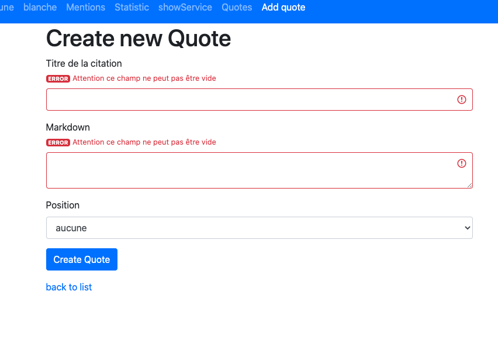

# Synthèse

## Modifier l'entité Quote

1. Ajoutez le champ position, il ne pourra prendre que les deux valeurs suivantes ainsi que la valeur null :

- important

- none 


Définissez deux constantes dans votre classe :

```php

const PRIORITY_NONE = 'none';
const PRIORITY_IMPORTANT = 'important';

```

Dans votre setter vérifiez que ces deux valeurs sont bien celles que l'on souhaite enregistrer en base de données :

```php
if (!in_array($position, array(self::PRIORITY_NONE, self::PRIORITY_IMPORTANT))) {
    throw new \InvalidArgumentException("Invalid status");
}
```

2. Créez également le champ created_at un datetime.

3. Hydratez vos tables avec ses nouvelles données (Fixtures). Donnez des dates différentes à vos citations.

## Exercice service & Repository

Vous ne pouvez pas faire facilement d'UNION SQL avec Doctrine (DQL), vous pouvez cependant toujours utiliser PDO pour faire une requête native. 
Pour cet exercice créez deux méthode quoteImportant et quoteNone dans votre repository. Et utilisez ces deux méthodes dans votre services QuoteService pour afficher les citations par ordre d'importance et de date de création décroissante.

## Gestion de la validation

Pour cette partie mettez votre formulaire en mode no validate, pour tester les validations côté back.

```html
{{ form_start(form, {'attr': {'novalidate': 'novalidate'}}) }}
    {{ form_widget(form) }}
{{ form_end(form) }}
```

Vous allez utiliser les asserts de doctrine associés à vos formulaires pour gérer les messages d'erreur. Installez tout d'abord la dépendance suivante :

```bash
composer require symfony/validator doctrine/annotations
```

Aidez vous de la documentation suivante choisissez la forme notation pour définir vos contraintes de validation.

[NotBlank](https://symfony.com/doc/current/reference/constraints/NotBlank.html)

1. Le champ titre est obligatoire et le titre doit être compris entre 5 et 60 caractères.

2. Le contenu du markdown ne peut pas être vide.

3. La position ne peut accepter que les trois valeurs suivantes : important, none ou null



## Ajoutez un bouton de suppression

1. Voici le code pour supprimer une citation. Mettez le en place directement dans la liste des quotes.


```php

<form method="post" action="{{ path('quote_delete', {'id': quote.id}) }}" 
onsubmit="return confirm('Are you sure you want to delete this item?');">
    <input type="hidden" name="_token" value="{{ csrf_token('delete' ~ quote.id) }}">
    <button class="btn btn-danger">Delete</button>
</form>

```

Lorsque vous recevez la ressource à supprimer (la bière). Vous vérifiez que vous avez envoyé le bon formulaire au bon script à l'aide du code Symfony suivant :

```php
$this->isCsrfTokenValid('delete' . $quote->getId(), $request->get('_token')); 
```

Le code ci-dessus retournera true si c'est le bon token et false sinon. Ceci évite de vous faire attaquer par un formulaire qui ne viendrait pas de votre framework.

2. Créez également un bouton d'édition afin d'édtier une citation pour la modifier.

Pour information vous avez une commande dans Symfony qui permet de générer un CRUD directement à partir d'une ressource, vous pouvez la tester, cependant donnnez un autre nom à celle-ci car, nous avons déjà un dossier quote et un contrôleur QuoteController.

```bash
php bin/console make:crud Quote
```

3. Ajoutez également un message de success ou d'échec (flash message) lorsque vous faite une suppression, ajout ou modification. Utilisez pour cela dans votre méthode le code qui suit, une méthode addFlash existe implémentée pour tous les contrôleurs.

```php
 $this->addFlash('success', 'Quote updated! Knowledge is power!');
 ```

 Faites un template message.html.twig que vous importerez dans le fichier listant les quotes.

4. Si vous avez du temps ajouter un pop up de confirmation pour la suppression.

## Mini projet de service

1. Affichez le score de chaque bière.

2. Créez un service RecommendationService. Ce dernier anaylisera les bières et selon leur score important, entre 20 et 16, taguera ces bières comme des bières à recommander.

3. Faites un lien qui permet de lister l'ensemble des bières recommandées.
